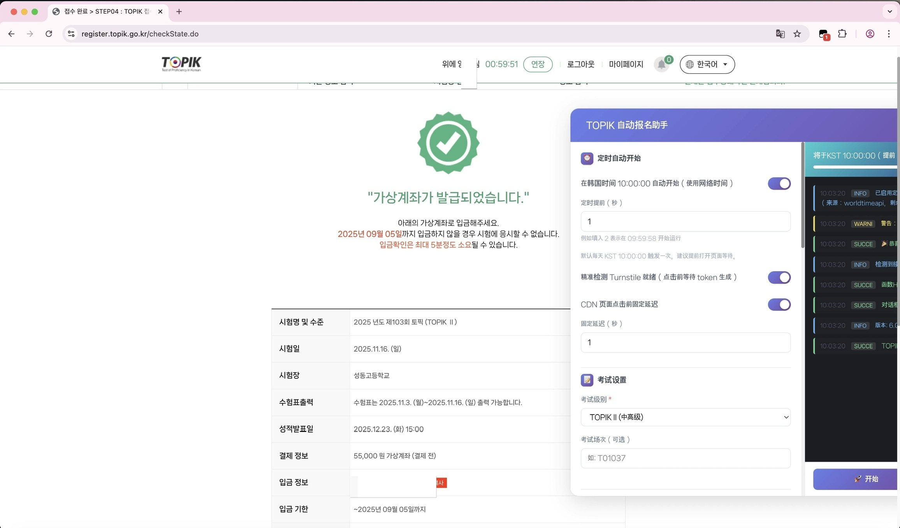

<div align="center">

# 🇰🇷 TOPIK Ultimate User Script

> **针对 [topik.go.kr](https://www.topik.go.kr) 的全流程自动化报名辅助工具**

基于 JavaScript和 jQuery 开发，专为韩国语能力考试 (TOPIK) 韩国考点报名设计。通过直接操作 DOM 和模拟用户行为，实现了从登录、排队到考场选择、支付的全流程自动化。



</div>

## 核心功能

### 1. 智能排队与 CDN 绕过
- **自动排队**: 自动检测 `cdn.topik.go.kr` 的排队页面，并在排队结束后自动跳转。
- **Turnstile 验证支持**: 集成 Cloudflare Turnstile 状态检测，确保在人机验证通过后立即尝试进入，避免无效点击。

### 2. 极速考场抢座
- **多级策略**: 支持配置“首选考场列表”和“地区兜底”策略。脚本会优先尝试首选考场，若已满则自动扫描同地区的其他可用考场。
- **实时监控**: 在考场选择页面 (`selectExmr.do`) 实时刷新并分析 JSON 数据，毫秒级响应席位变化。

### 3. 全自动表单填充
- **个人信息**: 自动填写英文姓名、出生日期、性别、联系电话等基础信息。
- **地址处理**: 针对复杂的韩国地址选择器，支持自动匹配和填写。

### 4. 支付流程自动化
- **支付方式**: 支持“虚拟账户 (Virtual Account)”和“信用卡 (Credit Card)”自动选择。
- **银行偏好**: 针对虚拟账户支付，可预设偏好银行，脚本自动在支付网关中选择。

### 5. 稳定性保障
- **会话保活**: 内置 Session 自动续期功能，防止在长时间等待或排队中因会话超时而掉线。
- **弹窗拦截**: 自动屏蔽原生的 `alert` 和 `confirm` 弹窗，防止因浏览器阻塞导致流程中断。


## 配置说明

脚本首次运行后，会使用 `GM_setValue` 将默认配置保存在本地存储中。你可以通过脚本菜单或直接修改代码中的 `config` 对象进行调整。

### 关键配置项

```javascript
const config = {
    // 运行模式: 'Login' (登录) | 'Queue' (排队) | 'Main' (主流程) | 'Auto' (自动检测)
    mode: 'Auto',

    // 考试级别: 'TOPIK I' | 'TOPIK II'
    examLevel: 'TOPIK II',

    // 考场偏好设置
    locations: [
        "首尔大学",   // 优先级 1
        "延世大学",   // 优先级 2
        "高丽大学"    // 优先级 3
    ],

    // 兜底策略: 如果偏好考场都满了，尝试该地区任意有座位的考场
    regionFallback: "首尔",

    // 个人信息 (请务必准确填写)
    userInfo: {
        engName: "HONG GIL DONG",
        birthDate: "19990101", // 格式: YYYYMMDD
        gender: "M",           // M: 男, F: 女
        phone: "010-1234-5678"
    },

    // 支付设置
    payment: {
        method: "Virtual Account", // 推荐使用虚拟账户，无需立即付款
        bank: "Shinhan Bank"       // 虚拟账户开户行
    }
};
```

---

## 技术原理

本脚本深入分析了 TOPIK 官网的前后端交互逻辑，针对关键节点进行了优化：

1.  **CDN Gate (排队系统)**:
    -   监控 `NetFUNNEL` 状态，在 `WG_TOKEN` 生成瞬间触发跳转，比人工点击更快。
2.  **AJAX 劫持与解析**:
    -   在考场选择页面，脚本不依赖缓慢的 DOM 渲染，而是直接监听 `/ajax/getExmrList.do` 的响应数据。
    -   一旦发现 `rcept_posbl_cnt > 0` (剩余席位大于0) 的考场，立即构造 POST 请求直接提交，跳过中间步骤。
3.  **Session 管理**:
    -   通过定时调用 `/ajax/setSessionTime.do` 接口，在后台静默续期 Session，确保长时间挂机不掉线。

---

## 免责声明
仅供学习研究
