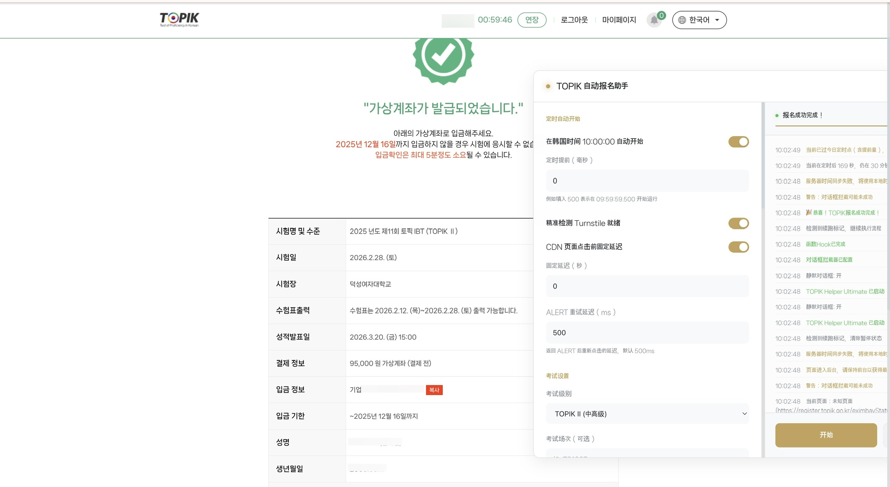

<div align="center">

# 🇰🇷 TOPIK Ultimate User Script

> **针对 [topik.go.kr](https://www.topik.go.kr) 的全流程自动化报名辅助工具**

基于 JavaScript 和 jQuery 开发，专为韩国语能力考试 (TOPIK) 韩国考点报名设计。通过直接操作 DOM 和模拟用户行为，实现了从登录、排队到考场选择、支付的全流程自动化。



</div>

## 核心功能

### 1. 智能排队与 CDN 绕过
- **自动排队**: 自动检测 `cdn.topik.go.kr` 的排队页面 (WebGate/NetFUNNEL)，并在排队结束后自动点击进入
- **Turnstile 验证支持**: 集成 Cloudflare Turnstile 状态检测，支持多种检测方式（隐藏字段、Widget 状态、API 响应），确保人机验证通过后才尝试进入
- **定时启动**: 支持在 KST 10:00:00 自动启动，内置高精度 Web Worker 定时器

### 2. 极速考场抢座
- **按名称智能匹配**: 支持输入考场名称（中文/韩文），自动解析为考场代码
- **静态考场映射**: 内置 50+ 考场的完整映射表，包含 `nfrcmnt_cd` 和 `exmr_cd`
- **地区兜底策略**: 首选考场满员时，自动扫描同地区其他可用考场
- **最终捡漏**: 可选启用"任意可用考场"兜底策略

### 3. 全自动表单填充
- **个人信息**: 自动填写国籍、母语、职业、应试目的等必填项
- **地址处理**: 针对复杂的韩国地址选择器，支持自动匹配和填写
- **站点函数调用**: 通过调用 `selNation`/`selLang`/`selJob` 等原生函数确保选择生效

### 4. 支付流程自动化
- **支付方式**: 支持"虚拟账户 (Virtual Account)"和"信用卡 (Credit Card)"自动选择
- **银行偏好**: 针对虚拟账户支付，可预设偏好银行
- **MinglePay 处理**: 自动处理 `pg.minglepay.co.kr` 支付页面的勾选和确认

### 5. 稳定性保障
- **会话保活**: 内置 Session 自动续期功能，防止长时间等待中会话超时
- **弹窗拦截**: 超早期注入页面上下文，自动拦截 `alert`/`confirm`/`prompt` 弹窗
- **断点续跑**: 页面刷新或跳转后自动恢复流程状态，支持跨域续跑

---

## 配置说明

脚本首次运行后，会使用 `GM_setValue` 将配置保存在本地。可通过脚本 GUI 面板直接修改。

### 关键配置项

```javascript
const Config = {
    // === 定时启动 ===
    scheduledStartEnabled: true,      // KST 10:00:00 自动开始
    scheduledStartAdvanceMs: 0,       // 提前量（毫秒）

    // === CDN/人机验证 ===
    enableTurnstileGating: true,      // 等待 Turnstile 验证通过
    enableCdnClickDelay: false,       // CDN 页面固定延迟
    cdnClickDelaySec: 1,              // 延迟秒数
    alertRetryDelayMs: 500,           // ALERT 重试延迟
    cdnAlertMaxRetries: 5,            // 最大重试次数

    // === 考场配置 ===
    examLevel: '8',                   // 7=TOPIK I, 8=TOPIK II, 9=Speaking
    preferredLocationName: '서울대학교',  // 按名称选择（支持中韩文）
    backupLocations: [],              // 备用考场列表
    enableRegionFallback: false,      // 地区兜底
    regionFallbackList: '서울,부산',  // 兜底地区
    enableFirstAvailableFallback: false, // 最终捡漏

    // === 用户信息 ===
    userInfo: {
        nationality: 'CHN',           // 国籍代码
        motherLanguage: 'ZH',         // 母语代码
        occupation: '01',             // 职业代码
        purpose: '1',                 // 应试目的
        username: '',                 // TOPIK 账号
        password: ''                  // TOPIK 密码
    },

    // === 支付 ===
    paymentMethod: 'virtual',         // virtual/card
    paymentBank: '',                  // 银行名称

    // === 对话框 ===
    silentDialogs: true,              // 静默拦截弹窗
    confirmDefault: true              // confirm 默认返回值
};
```

---

## 技术原理

### 1. 超早期对话框拦截
```javascript
// @run-at document-start 阶段注入
const script = document.createElement('script');
script.textContent = `
    window.alert = function(msg) { /* 静默 */ };
    window.confirm = function(msg) { return true; };
`;
document.documentElement.appendChild(script);
```

### 2. CDN Gate (排队系统)
- 监控 `NetFUNNEL` 状态，检测 `$WG.lastResponse.GateOperationMode`
- 在 `WG_TOKEN` 生成瞬间触发跳转
- 多次 ALERT 后自动刷新页面获取新 Turnstile token

### 3. 考场选择与 AJAX Hook
- Hook `$.ajax` 监听 `/ajax/getExmrList.do` 响应
- 检测 `rcept_posbl_cnt > 0` (剩余席位) 的考场
- 直接注入 `nfrcmnt_cd` 和 `exmr_cd` 提交请求

### 4. Session 管理
- 定时调用 `/ajax/setSessionTime.do` 续期
- 后台静默执行，确保长时间挂机不掉线

### 5. 断点续跑
- 使用 `GM_setValue` 持久化 `resume` 标记
- 页面加载时检测标记，自动恢复流程状态

---

## 考场代码映射（部分示例）

| 考场名称 | nfrcmnt_cd | exmr_cd | 地区 |
|---------|------------|---------|------|
| 서울대학교 | 001009 | 00900 | 首尔 |
| 고려대학교 | 001001 | 00100 | 首尔 |
| 연세대학교 | 001007 | 00700 | 首尔 |
| 부산대학교 | 001015 | 01500 | 釜山 |
| 제주대학교 | 001046 | 04600 | 济州 |

完整映射表内置于 `LOCATION_MAP` 对象，支持 50+ 考场。

---

## 免责声明
仅供学习研究
